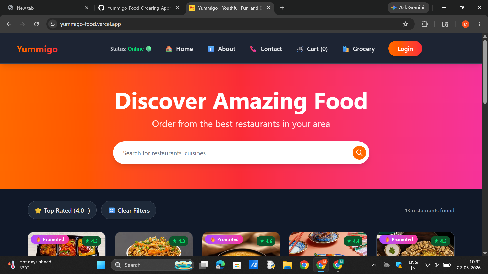
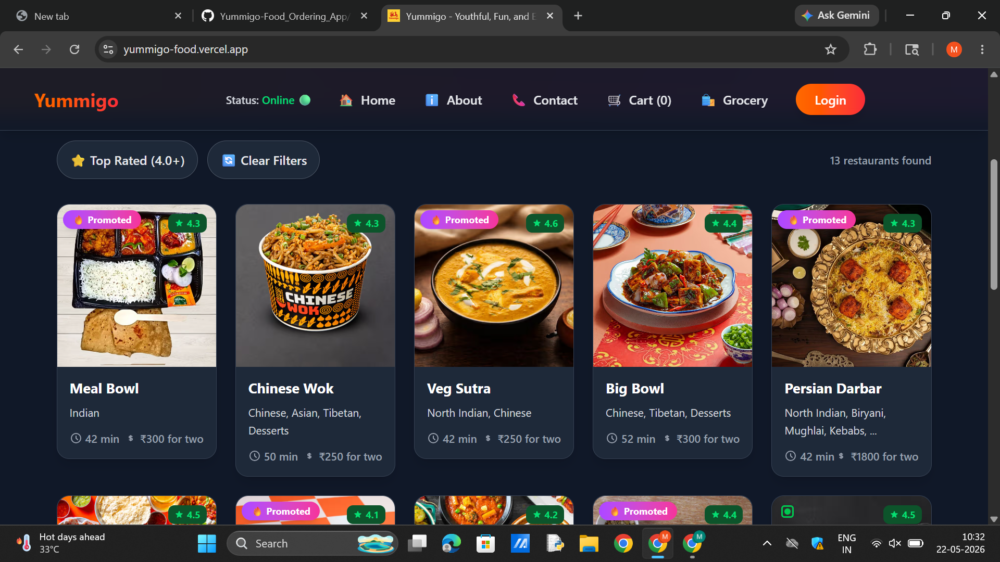
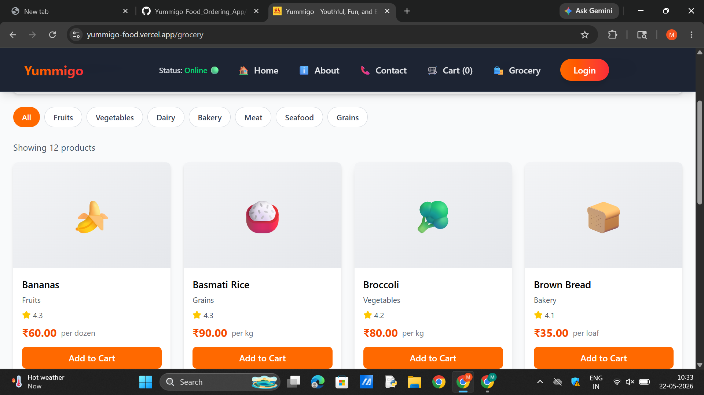

#  Yummigo - Youthful, Fun, and Expressive Food Ordering App

Yummigo is a dynamic and modern food ordering web application that lets users browse restaurants, explore menus, order food and groceries, and manage their cart seamlessly. With a stylish UI, responsive design, and robust architecture powered by React and Redux, Yummigo delivers a user-centric ordering experience.

---

##  Live Demo

[Yummigo](https://yummigo-food.vercel.app/)


###  Home Page



###  Restaurant Listing



###  Grocery Store



---

##  Features

-  User-friendly and modern UI  
-  Browse restaurants and food items  
-  Add to Cart / Remove Items / Clear Cart  
-  Grocery Store with filters and sorting  
-  Live Search & Rating Filter  
-  Responsive layout (Mobile & Desktop)  
-  State management with **Redux**  
-  Unit Testing with **Jest + React Testing Library**  
-  Promoted badge for featured restaurants  
-  Simulated Login/User Display  
-  Status Indicator

---


## Tech Stack

| Technology       | Role                              |
| **Tailwind CSS** | Utility-first Styling             |
| **React.js**     | UI Library                        |
| **Redux**        | State Management                  |
| **Vite**         | Development & Build Tool          |
| **Swiggy API**   | Realistic Food Delivery Data Mock |
| **Jest**         | Testing Framework                 |
| **React Testing Library** | Component Testing        |

---


---

## Testing

Yummigo has component-level testing using:

- **Jest**
- **React Testing Library**

Test files:
- `App.test.jsx`
- `Cart.test.jsx`
- `RestoCard.test.jsx`
- `sum.test.js`, etc.

---

## Installation & Setup

To run the project locally:

```bash
# Clone the repository
git clone https://github.com/Mohataseem89/Yummigo.git
cd Yummigo

# Install dependencies
npm install

# Start development server
npm run dev
---
```


##  Author

**Mohataseem Khan**
 Connect with me: [LinkedIn](https://www.linkedin.com/in/mohataseem-khan/) • [GitHub](https://github.com/Mohataseem89)


